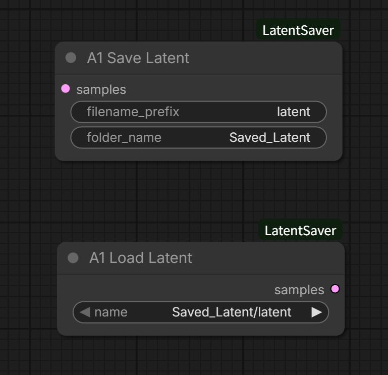
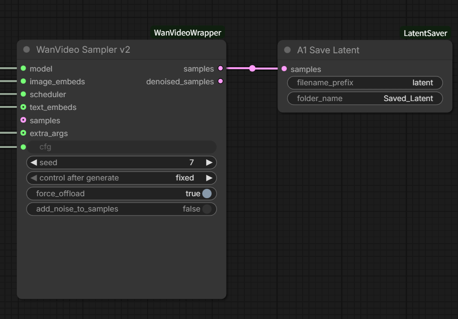
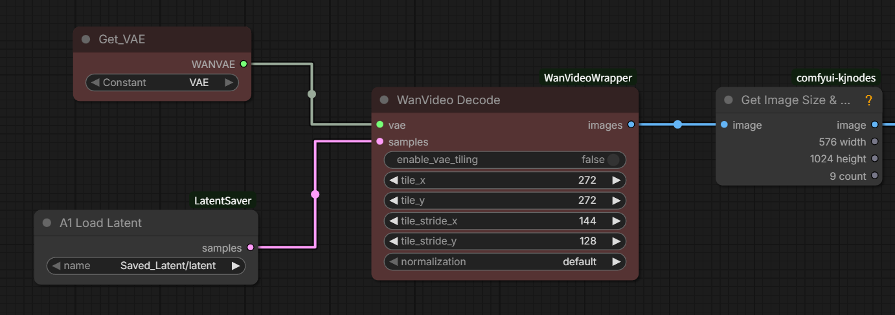

# ComfyUI LatentSaver

ComfyUI에서 영상·이미지 생성 시 Sampling 이후 생성된 **Latent 값을 저장하고 다시 불러오기 위한 노드**입니다.  
Decode 단계에서 VRAM Out of Memory(OOM)로 작업이 중단되는 문제를 해결하는 것을 목적으로 합니다.

---

Sampling 이후 Latent를 저장하고, ComfyUI를 재시작한 뒤  
저장된 Latent를 다시 불러와 Decode에 연결하는 전체 흐름은 아래와 같습니다.

---

Sampling 이후 생성된 Latent는 **Save Latent** 노드를 통해 output 폴더에 저장됩니다.

- Latent는 항상 **output 폴더 기준**으로 저장됩니다  
- 파일 이름과 하위 폴더 이름은 **자유롭게 수정 가능**합니다  
- 단, **output 폴더 내부에서만** 경로 및 이름 변경이 가능합니다  

저장 예시는 다음과 같습니다.

---

저장된 Latent는 **Load Latent** 노드를 통해 다시 불러옵니다.

- Load 시 **output 폴더 하위에 존재하는 모든 latent 파일을 자동으로 검색**합니다  
- 저장된 정확한 경로를 기억할 필요가 없습니다  
- output 하위 모든 폴더를 탐색하여 latent 파일을 불러오기 때문에  
  다시 연결하는 과정이 훨씬 단순합니다  

저장된 Latent를 다시 Decode에 연결하는 예시는 아래와 같습니다.

---

영상 생성 작업에서 자주 발생하는 문제 흐름은 다음과 같습니다.

1. Sampling 단계까지는 정상적으로 완료  
2. Decode 단계에서 **VRAM Out of Memory(OOM)** 발생  
3. ComfyUI가 종료되며 작업 중단  

LatentSaver를 사용하면 다음과 같이 작업할 수 있습니다.

1. Sampling 완료 후 Latent를 미리 저장  
2. Decode 단계에서 OOM 발생  
3. ComfyUI 재시작  
4. Load Latent로 이전 Latent 불러오기  
5. Decode에 바로 연결하여 이전 결과를 그대로 이어서 확인  

Sampling을 다시 돌릴 필요 없이  
이미 계산한 결과를 유지한 채  
지금까지 열받던 VRAM 문제를 깔끔하게 해결할 수 있습니다.

---

이 노드에는 다음 기능이 포함되어 있습니다.

- Save Latent  
- Load Latent  

Latent는 항상 output 폴더 기준으로 저장·로드되며,  
output 하위 폴더 구조는 자유롭게 구성할 수 있습니다.  
ComfyUI 재시작 이후에도 저장된 Latent는 유지됩니다.  
VRAM이 작은 환경에서 특히 유용합니다.

---

A1
